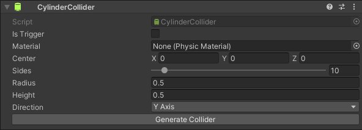

# CylinderCollider
A cylinder collider approximation made of primitive colliders.

## Description
**CylinderCollider** is a compound collider made of **BoxColliders**. It's usage is limited in 
playmode as making it dynamically editable could make it more computationally demanding.

Project contains benchmark scene to compare mesh-based cylinder colliders with
primitive-collider-based colliders.

Mesh-based cylinder colliders seem to have better performance, but the compound colliders may 
still perform better than more complex mesh colliders as stated in
[Unity Documentation](https://docs.unity3d.com/Manual/CollidersOverview.html).

2000 cylinder compound colliders with 12 sides:

2000 mesh colliders with 12 sides:

## Instruction
 * Select the game object you want to add **CylinderCollider**
 * Click **AddComponent** button
 * Select **Physics** tab and click **CylinderCollider**
 * Set appropriate values in **CylinderCollider** inspector
 * Click **Generate Collider** button

If you want to modify prefabs with **CylinderCollider**, then you need to go to prefab editor and
generate colliders as prefabs in scene editor cannot destroy child objects without losing prefab 
link.

## Requirements
No special requirements are required. Package is tested and works in Unity 2019.4.28f1, however 
**CylinderCollider** may work in newer as well as in older Unity versions.

## Instalation
Download release unitypackage and import it to your project.

## License
**CylinderCollider** is licensed under the MIT license. **CylinderCollider** is free for 
commercial and non-commercial use.

[More about license.](./LICENSE)
